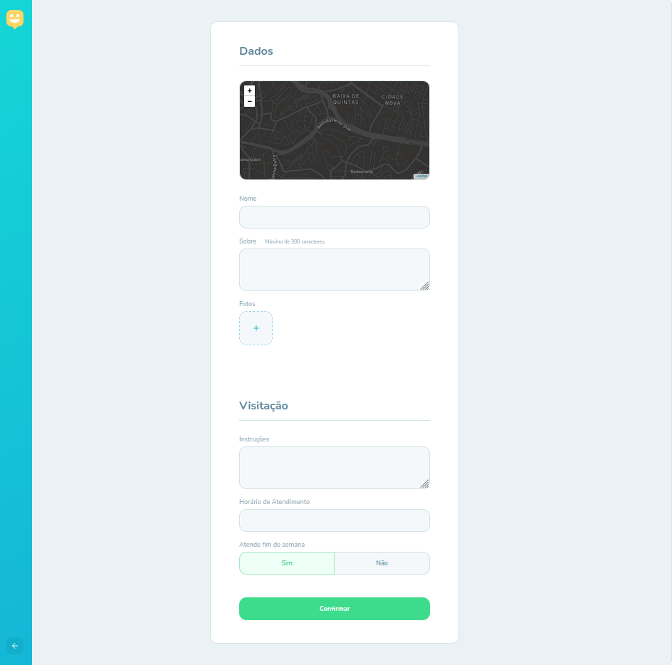

# nlw3-web

Aplicação para marcação de orfanatos em uma mapa com informações para promover visitas e acões de ajuda.
Parte do conteúdo foi disponibilizado no NLW 3, evento realizado pela Rocketseat (https://github.com/Rocketseat).

## Demonstração

### Apresentação

### Mapa

### Cadastro

### Detalhe


## Ambiente (Versões)
1. node -v : v12.19.0 (choco upgrade nodejs-lts)
2. npm -v : 6.14.8
3. yarn -v : 1.22.5 (choco upgrade yarn)

## Execução
```sh
cd nlw3-web
yarn
yarn start
```

## Variáveis de ambiente
1. Criar um arquivo .env na raiz do projeto com o token do Mapbox, que é a API de mapas que é utilizada nesse projeto. 

```env
REACT_APP_MAPBOX_TOKEN=[token_mapbox]
``` 

## Roteiro para criação desse projeto
1. yarn create react-app web --template typescript

## Pacote de ícones
2. yarn add react-icons

## Módulo de navegação entre páginas
3. yarn add react-router-dom
4. yarn add @types/react-router-dom -D

## Módulo de mapas
6. yarn add leaflet react-leaflet
7. yarn add @types/react-leaflet -D

## Módulo de requisições
Para realizar requisições entre front-end e back-end pode ser utilizado o fetch() nativo do browser, porém é melhor utilizar o axios porque com ele é possível definir uma baseUrl não sendo necessário informar todo o texto da requisição que é repetida nas diversas chamadas à mesma API.
8. yarn add axios
9. criar a pasta services (que pode ser utilizado para qualquer tipo de comunicação com servições externos: banco de dados, API, envio de alguma coisa, indexDb, local storage) dentro da pasta src, e dentro da pasta services criar o arquivo api.ts.
10. toda a lógica de interação das telas (interação com o usuário, comunicação com API) devem ser feitas no React utilizando o hooks (useEffect), onde o primeiro argumento é uma função que conterá o código que deve ser executado, e o segundo argumento é um array de variáveis que quando tiverem seus valores alterados irão disparar a execução da função no primeiro argumento.

## UseState
Para qualquer tipo de informação que se queira armazenar no componente (funcionalidade similar a uma session)
